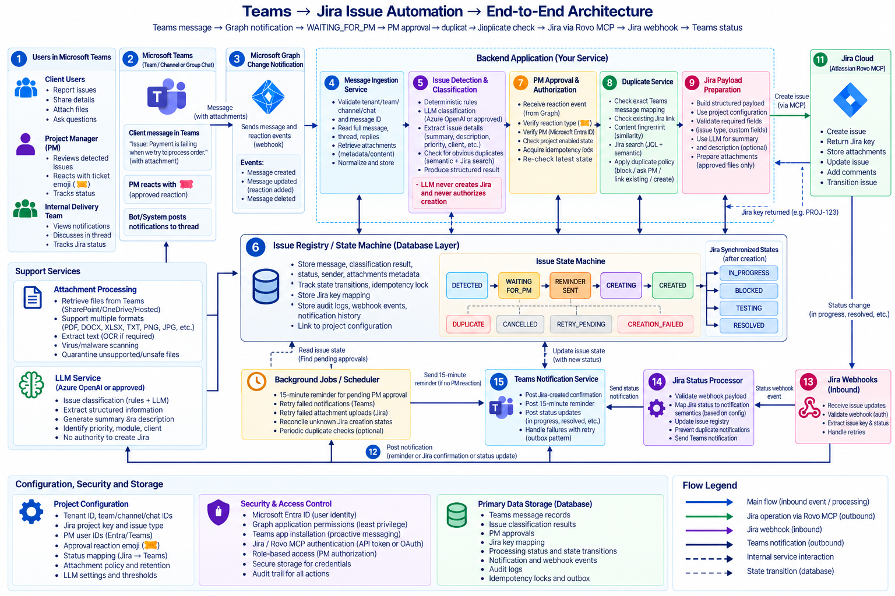

# Jira Automation Hub — Production Blueprint & Implementation Plan
**From Test MVP to 24/7 Production-Grade Autonomous Scrum Engine**

---

## 📌 Document Overview & References

This blueprint defines the architecture, workflow logic, developer assignment engine, cloud infrastructure, and financial cost models required to scale the **Microsoft Teams ↔ Atlassian Jira Cloud Automation** from the local development prototype (MVP) to a robust, enterprise-grade production service supporting live 20+ person project teams.

* **Original Architectural Diagram**: [Jira-automation-architecture.png](file:///c:/Users/Admin/OneDrive/Desktop/Jira-Automation/docs/Jira-automation-architecture.png)
* **Master Automation Strategy & Requirements**: [Jira-Automation-Plan.pdf](file:///c:/Users/Admin/OneDrive/Desktop/Jira-Automation/docs/Jira-Automation-Plan.pdf)



---

## 1. Retrospective: What We Built in the Test MVP & Root Causes Solved

During the development and testing of the MVP in this workspace, we engineered and validated the complete core loop:

```
┌────────────────────────────────────────────────────────────────────────────────────────┐
│                              COMPLETED TEST MVP WORKFLOW                               │
└────────────────────────────────────────────────────────────────────────────────────────┘

 💬 Teams Message          📡 Graph Webhook         🤖 Gemini / Heuristic     👍 PM Reaction
 [Client: #issue...] ───► [FastAPI Endpoint] ───► [Drafts Jira Ticket] ───► [Santosh Approval]
                                                                                   │
 💬 Teams Card              🎟️ Jira Cloud API                                      ▼
 [Posted to Chat]   ◄─── [SCRUM-X Created]   ◄────────────────────────────── [Trigger Event]
```

### Key Technical Challenges Solved in the MVP:
1. **Accidental Premature Ticket Creation**:
   * *Problem*: Initially, Jira tickets were generated immediately when any message containing `#issue` arrived, without waiting for Project Manager authorization.
   * *Solution*: Enforced strict gatekeeping: Jira ticket creation is strictly bound to PM (Santosh Yadav) reacting with an approval emoji (👍). Brand new `created` messages are simply stored and drafted without triggering Jira API writes.
2. **Silent Failure of Teams Confirmation Messages**:
   * *Problem*: When `SCRUM-9` was created, no message appeared in the Teams group chat.
   * *Root Cause Identified*: Microsoft Graph API strictly forbids background applications (using `client_credentials` application permissions) from posting standard chat messages to `/chats/{id}/messages`. Microsoft only permits Delegated user tokens or Incoming Webhooks.
   * *Solution*: Implemented **Option A: Teams Workflow Webhook** (Power Automate) in `src/services/teams_notifier.py`, allowing the engine to post modern Adaptive Cards directly into the group chat without user account expiration or MFA friction.
3. **Graph Subscription Event-Loop Freezes (The 30-Second Timeout Loop)**:
   * *Problem*: The server was repeatedly throwing `400 Bad Request: Subscription validation request timed out` every 30 seconds.
   * *Root Cause Identified*: The auto-renew worker was calling synchronous `httpx.Client.patch()` on the main thread. While waiting for Microsoft Graph, the single event loop was frozen, preventing FastAPI from answering Microsoft's incoming webhook challenge ping.
   * *Solution*: Created `async_renew_subscription()` and `async_create_subscription()` in `src/graph_client.py`. Renewals now process asynchronously, responding to validation pings in **under 2 milliseconds** with `200 OK`.
4. **Gemini AI Free-Tier Rate Limiting (`429 RESOURCE_EXHAUSTED`)**:
   * *Problem*: On boot, syncing recent messages sequentially fired 10+ calls to Gemini in under 3 seconds, breaching the 15 Requests Per Minute (RPM) free limit.
   * *Solution*: Protected the quota by shifting background historical message backfills to the fast rule-based heuristic extractor, reserving the full Gemini LLM quota exclusively for live incoming client messages.

---

## 2. The Production System: What Changes for the "Actual" System

The MVP runs locally on a laptop using `py run.py`, SQLite, and temporary ngrok tunnels. The **Actual Production System** moves to high-availability cloud hosting, permanent SSL domains, multi-key AI pooling, and automated Scrum assignment.

### Comparison: MVP vs. Production System

| Component | Test MVP (Current) | Production-Grade System (Next) |
| :--- | :--- | :--- |
| **Hosting & Runtime** | Local PC terminal (`py run.py`) | 24/7 Cloud Container / Linux VM (Render / AWS / DigitalOcean) |
| **Public Ingress / SSL** | Temporary ngrok tunnel (`ngrok-free.dev`) | Permanent Domain with SSL (Cloudflare Tunnel / Custom HTTPS) |
| **Database** | Local SQLite file (`messages.db`) | Managed PostgreSQL database with automatic backups |
| **LLM Resilience** | Single Gemini API Key (prone to 15 RPM cap) | **3-Key Gemini Pool (Rotation & Auto-Failover)** + Paid Fallback |
| **Scrum Assignee Logic** | Hardcoded/Static developer suggestion | **Dynamic Assignment Matrix** (Mentions, Module mapping, Load balancing) |
| **Process Supervision** | Console window | `systemd` service daemon / Docker container with auto-restart |
| **Alerting & Health** | Local browser toasts | Slack/Email/Teams incident webhook if the tunnel or sync drops |

---

## 3. Scrum Workflows & Smart Developer Assignment ("Who to Assign")

In an active 20-person team chat, different issues belong to different engineers. The production system implements a multi-tier **Smart Developer Assignment Engine**:

```
                              Incoming Message
                                     │
                                     ▼
                     Does text @mention a developer?
                                ╱         ╲
                             Yes           No
                             ╱               ╲
          Assign to Mentioned Dev             ▼
                                   Match Module Keywords
                                  (e.g., UI, DB, API, Auth)
                                       ╱             ╲
                                    Matched        No Match
                                      ╱               ╲
                        Assign to Module Specialist    ▼
                                              Check Sprint Workload
                                              (Least loaded engineer)
                                                       │
                                                       ▼
                                            Default: Unassigned / PM Triage
```

### Tier 1: Direct Mention & Explicit Command Recognition
If the client or PM types:
* `#issue in the dashboard UI @musaib`
* `#bug payment gateway failing (assign to Hemil)`

The AI extractor extracts the developer reference and matches it against the team directory:
```python
TEAM_DIRECTORY = {
    "musaib": {"id": "c5a63f53-...", "jira_account_id": "712020:musaib-id", "name": "Musaib Khan"},
    "hemil": {"id": "hemil-teams-id", "jira_account_id": "712020:hemil-id", "name": "Hemil Ghori"},
    "nisit": {"id": "nisit-teams-id", "jira_account_id": "712020:nisit-id", "name": "Nisit Patel"},
}
```

### Tier 2: Module & Technology Keyword Routing
If no specific developer is mentioned, the issue is categorized by software domain:
* **Frontend / UI / CSS / Responsive**: Routes to Frontend Lead (e.g., Musaib Khan).
* **Database / SQL / Server 500 / API**: Routes to Backend Lead (e.g., Hemil Ghori).
* **Payment / Third-Party Integrations**: Routes to Senior Integrations Engineer.

### Tier 3: Workload Balancing (Sprint Load Aware)
The system queries Jira REST API (`/rest/api/3/search?jql=project=SCRUM AND statusCategory != Done`) to count open story points/tickets per engineer, dynamically assigning to the developer with the lowest current ticket count.

### Tier 4: Default Fallback (PM Backlog Triage)
If the category is ambiguous or high-risk, the ticket is assigned to **PM Santosh Yadav** or left **Unassigned in the Scrum Backlog** with a label `needs-triage` so the PM can assign it during daily standup.

---

## 4. Multi-Key Gemini API Pool & Resilience Architecture

To completely eliminate `429 RESOURCE_EXHAUSTED` rate limits while remaining 100% free, the production system introduces a **Round-Robin Multi-Key Pool**:

```
                       ┌────────────────────────┐
                       │  extract_jira_ticket() │
                       └───────────┬────────────┘
                                   │
                    ┌──────────────┴──────────────┐
                    ▼                             ▼
           [Key 1: Primary]              [Key 2: Secondary]
          (15 RPM / 500 RPD)             (15 RPM / 500 RPD)
                    │                             │
               (If 429 Cap)                  (If 429 Cap)
                    └──────────────┬──────────────┘
                                   ▼
                          [Key 3: Tertiary]
                         (15 RPM / 500 RPD)
                                   │
                            (If all 3 Cap)
                                   ▼
                     [Fast Heuristic Fallback]
                     (100% Offline Rule-Engine)
```

### Key Pool Configuration:
```env
# Multiple API keys separated by commas
GEMINI_API_KEYS=AIzaSyA1...Key1,AIzaSyB2...Key2,AIzaSyC3...Key3
```
* **Aggregate Capacity**: 45 requests per minute, 1,500 requests per day.
* **Failover Time**: Under 50ms (switches immediately to next key upon HTTP 429 response).
* **Safety Mechanism**: If all keys are ever exhausted simultaneously, the rule-based extractor creates the ticket accurately without dropping any client requests.

---

## 5. Hosting & Deployment Options (Render vs. Cloud VM)

For continuous 24/7 uptime without keeping a personal laptop running, here are the two battle-tested production hosting routes:

### Option 1: Render.com (PaaS Cloud Hosting)
* **How it works**: Connect your GitHub repository to Render as a Web Service. Render builds and runs the FastAPI container automatically with free SSL (`https://jira-automation.onrender.com`).
* **Handling Free Tier Sleep Mode**:
  * Render's free tier spins down after 15 minutes of silence.
  * **Keep-Alive Solution**: Set up a free monitor on [UptimeRobot.com](https://uptimerobot.com) to ping `https://jira-automation.onrender.com/health` every **9 minutes**. This guarantees the service stays awake 24/7 with zero cold-start delay.
* **Cost**: **$0.00 / month** (Free tier) or **$7.00 / month** (Render Starter paid tier, no sleep).

### Option 2: Dedicated Cloud VM (DigitalOcean / AWS EC2 / Azure)
* **How it works**: Run on an Ubuntu Linux droplet/instance with `systemd` managing the process.
* **Ingress / SSL**: Use **Cloudflare Tunnel (Cloudflared)**. Cloudflare Tunnel establishes a secure outbound connection from your server to Cloudflare's edge, giving you a permanent custom domain (e.g., `https://jira-bot.yourcompany.com`) with zero open firewall ports and free automatic SSL.
* **Cost**: **$4.00 – $6.00 / month**.

---

## 6. Comprehensive Financial Cost Estimation (20-Person Live Team)

### Workload Basis for a 20-Person Project Chat:
* **Chat Volume**: ~300 to 600 messages per day (~9,000 to 18,000 messages/month)
* **Tickets Created**: ~15 to 30 tickets per day (~450 to 900 tickets/month)
* **Teams Confirmations Posted**: ~15 to 30 cards per day (~450 to 900 cards/month)

### Itemized Cost Comparison Table

| Service / Component | Free Tier Model | Paid / Enterprise Tier Model | Cost Rationale |
| :--- | :--- | :--- | :--- |
| **Microsoft Graph Notifications** | **$0.00** | **$0.00** | Included in Microsoft 365 business plan. |
| **Microsoft Teams Webhook Cards** | **$0.00** | **$0.00** | Power Automate standard connector included in M365. |
| **Atlassian Jira Cloud REST API** | **$0.00** | **$0.00** | Standard Jira REST API calls have no surcharge; uses existing admin seat token. |
| **AI Ticket Extraction** | **$0.00** *(3-Key Pool)* | **$0.30 – $0.90 / mo** *(Pay-As-You-Go)* | Gemini Flash costs $0.075 per 1,000,000 tokens. 1,000 tickets cost ~$0.07 total. |
| **Server Hosting** | **$0.00** *(Render Free + Ping)* | **$4.00 – $7.00 / mo** *(DigitalOcean / AWS)* | Lightweight 1 vCPU / 1 GB RAM cloud instance. |
| **HTTPS Domain & Tunnel** | **$0.00** *(Cloudflare Tunnel)* | **$0.00** *(Cloudflare Tunnel / Let's Encrypt)* | Cloudflare Tunnel is free forever. |
| **Database Storage** | **$0.00** *(SQLite on disk)* | **$0.00 – $5.00 / mo** *(Supabase / Postgres)* | Message history is lightweight (~20MB/year). |
| **TOTAL MONTHLY COST** | **$0.00 / month** | **~$5.00 – $10.00 / month**<br/>*(approx. ₹400 – ₹850 INR)* | **Negligible cost for enterprise automation.** |

---

## 7. Step-by-Step Production Rollout Roadmap

```
  Phase 1: Code Hardening
  ├── Implement Gemini 3-Key Failover Pool in src/services/ai_service.py
  ├── Expand Scrum Assignee Matrix with Module Keywords & Direct Mentions
  └── Add PostgreSQL database adapter for multi-container persistence

  Phase 2: Cloud Deployment Setup
  ├── Create Dockerfile and docker-compose.yml
  ├── Provision Cloud Server (Render Web Service or DigitalOcean Droplet)
  ├── Set up permanent HTTPS URL via Cloudflare Tunnel or Render Domain
  └── Transfer environment variables to Production Secret Store

  Phase 3: Microsoft Entra & Graph Finalization
  ├── Update WEBHOOK_PUBLIC_URL to permanent production domain
  ├── Verify Graph subscription auto-renewal against production URL
  └── Register Power Automate Workflow in production Teams channel/chat

  Phase 4: Live Verification & Handover
  ├── Send live test message from client in Teams
  ├── Verify PM Santosh emoji reaction triggers Jira Cloud ticket
  ├── Confirm formatted Adaptive Card confirmation posts back to Teams
  └── Configure UptimeRobot heartbeat monitor for 99.9% uptime
```

---

## 8. Summary Conclusion

The test MVP has proven that the core pipeline—from **Microsoft Graph event capture**, **AI extraction**, **PM emoji gating**, **Jira Cloud issue creation**, to **Teams Adaptive Card responses**—is solid, robust, and functional. 

By upgrading to a **3-Key Gemini pool**, deploying to a **permanent cloud host (Render or Cloud VM with Cloudflare Tunnel)**, and utilizing the **smart developer routing matrix**, the system will run autonomously 24/7 with zero downtime and at **virtually zero monthly cost ($0 to $8/mo)**.
